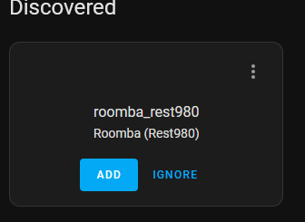
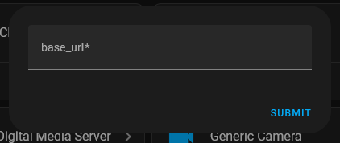
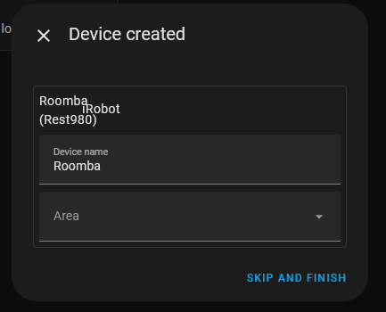
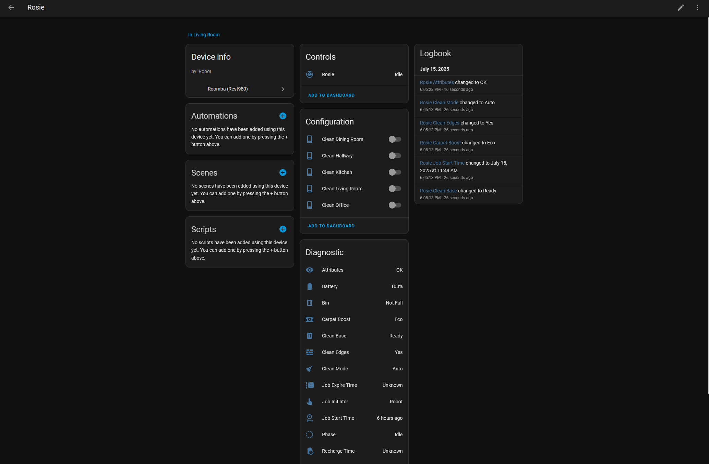
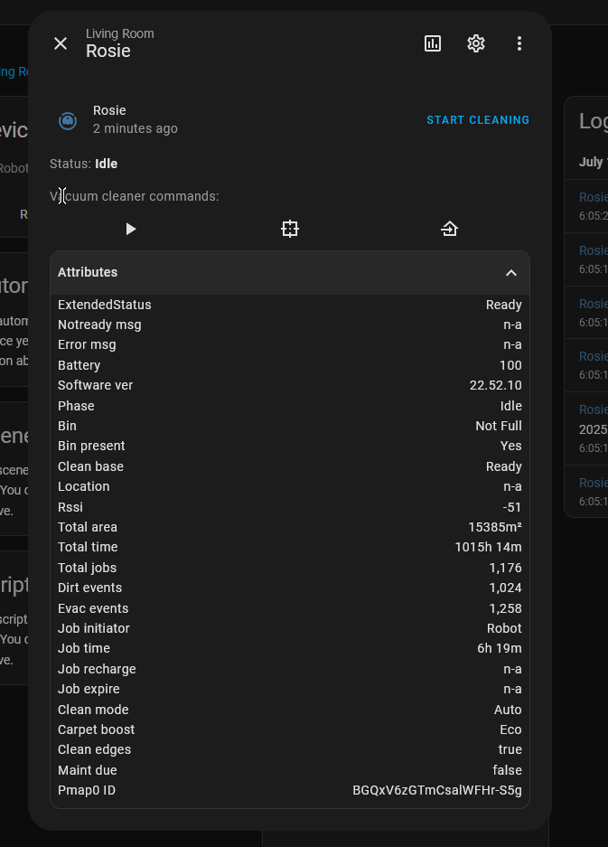

# roomba_rest980

Drop-in native integration/replacement for [jerrywillans/ha-rest980-roomba](https://github.com/jeremywillans/ha-rest980-roomba).

Still work in progress, but the vacuum entity has been fully ported over.

## Roadmap

- [x] Feature parity (minus actions) with vacuum entity
- [ ] Actions
- [ ] Dynamically grab rooms and add them to the UI

## Why?

I found that working with jeremywillans' implementation was nice and almost effortless, but I'd prefer to not have a YAML configuration and work with it by a more native integration that adds entities and isn't bound to making a lot of helpers per room.

## Setup

### Prerequisites / Recommendations

- HACS
- rest980
  - If you don't have it yet, don't worry; this guide will show you how to add it.
- Rooms mapped/setup in iRobot app
  - Note that everytime you remap and a room changes, it's ID may change!
- Knowledge of your Roomba's IP

> I recommend that you use [the lovelace-roomba-vacuum-card](https://github.com/jeremywillans/lovelace-roomba-vacuum-card) until I remake it for this integration.


## Step 1: Setting up rest980: Grab Robot Credentials

If you already have it setup, and you know its url (like `http://localhost:3000`), you may skip this step.  
First, you must gather your robot's on-device password and BLID (identifier).

> NOTE: You cannot have the iRobot app running on your phone, or anything else connected to it during this step!

<details open>
  <summary>
  For Docker users
  </summary>
Execute this command:  
```sh
docker run -it node sh -c "npm install -g dorita980 && get-roomba-password <robotIP>"
```
and follow the on-screen instructions.
</details>

<details>
  <summary>
  HA Addon by jeremywillans
  </summary>

Add `https://github.com/jeremywillans/hass-addons` to the Addons tab.
Locate and install the `roombapw` addon, following the included instructions.

</details>

<details>
  <summary>
  Other HA installation method
  </summary>

If you dont have direct access to Docker, you can clone and install the dorita980 package locally.  
See [dorita980's instructions on how to get the credentials](https://github.com/koalazak/dorita980#how-to-get-your-usernameblid-and-password).

</details>

### Setting up rest980: Bringing The Server Up

Now that you have your robot's IP, BLID, and password, we need to actually start rest980.

<details open>
  <summary>
  For Docker users (docker-compose)
  </summary>

[Download the docker-compose.yaml file, and bring the service up.](docker-compose.yaml)

To bring the service up (just rest980) and leave it in the background, run

```sh
docker-compose up -d rest980
```

You may also add the service to an existing configuration. You do not need to add file binds/mounts, as there are not any.

</details>

<details>
  <summary>
  HA Addon by jeremywillans
  </summary>

If you haven't, add `https://github.com/jeremywillans/hass-addons` to the Addons tab.
Locate and install the `rest980` addon, then update and save the configuration options with the credentials you got from the previous step.
> NOTE: Rest980 Firmware option 2 implies v2+ (inclusive of 3.x)

</details>

<details>
  <summary>
    Other HA installation method
  </summary>

  Clone and start the [rest980 server by koalazak, and note your computer's IP and port.](https://github.com/koalazak/rest980)

</details>

## Step 2: Setting up the Integration

rest980 will gather all the data about our robot, but the integration will format it perfectly, creating entities and a vacuum device.

<details open>
  <summary>
  For HACS users
  </summary>
  Add this custom repository, `https://github.com/ia74/roomba_rest980` to HACS as an Integration. Search for the addon ("iRobot Roomba (rest980)") and install it!
</details>

<details>
  <summary>
  Manual installation
  </summary>
  Clone this repository, `https://github.com/ia74/roomba_rest980`, and add the custom component folder (`roomba_rest980`) to your Home Assistant's `config/custom_components` folder.
</details>

When you install the integration and restart Home Assistant, you will notice it picking up your Roomba.



This is not due to your rest980 API server being discovered, rather the integration finding your Roomba on the local network.

> If you do not see this, that is okay; it only means HA was able to fully detect a roomba through it's network identifiers.

## Step 3: Adding your Roomba!

If you see the autodiscovered integration, press "Add"!  
You'll be presented with this popup. It will be styled much better later, but this works well enough for now.



Input your rest980 server's url like so:

```
http://localhost:3000
```

and don't leave any trailing /s.

If you did it right, you'll see a success screen!  



If all has gone right, checking the device will show something like this:



But those aren't your rooms....

## Step 4: Rooms!

TO BE CONTINUED...
Rooms are not given to us easily, but a fix is in progress for that.

## Step 5: Robot Maintenance / Done!

> Unfortunately, this is not implemented yet, alongside any other action.

This integration will eventually support the maintenance function of the Roomba, but still is not implemented

## Cleaning a room using the Roomba from HA

> Unfortunately, this is not implemented yet, alongside any other action.

In any configuration you'd like, you may lay the switches on the dashboard and switch them in the order you want them cleaned. After that, press Start on the native Vacuum!

## Note:

Unfortunately, this is about where my current progress ends. We gather all the possible data and display it. I will be working on this integration however and eventually these features will be fully supported.

## Backwards Compatibility

Minus the actions (currently!), the integration adds all the attributes that you would expect from `jeremywillans` implementation, even adding an `extendedState` attribute that gives you "Ready", "Training", "Spot", etc. since HA doesnt do that natively for some odd reason.


